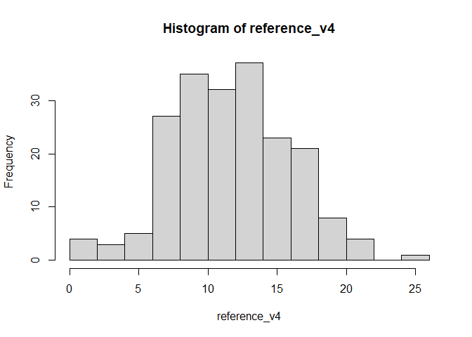
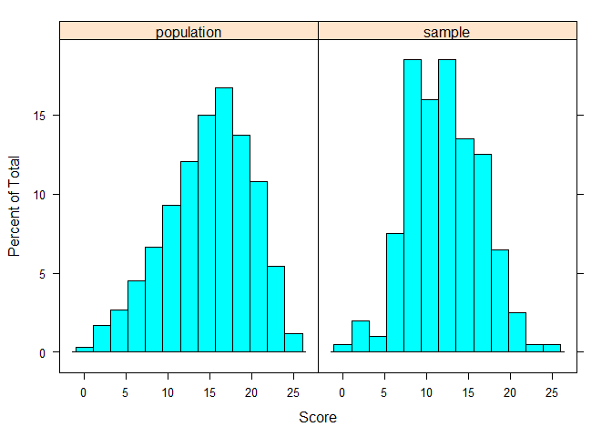
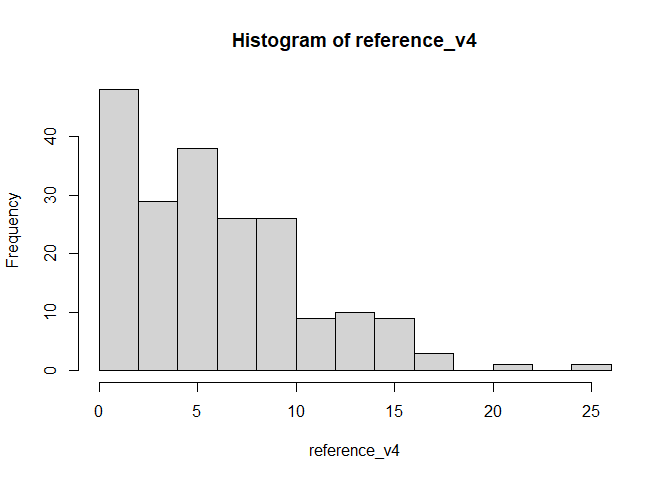
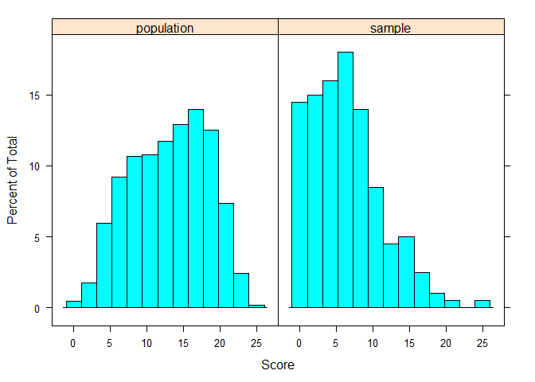
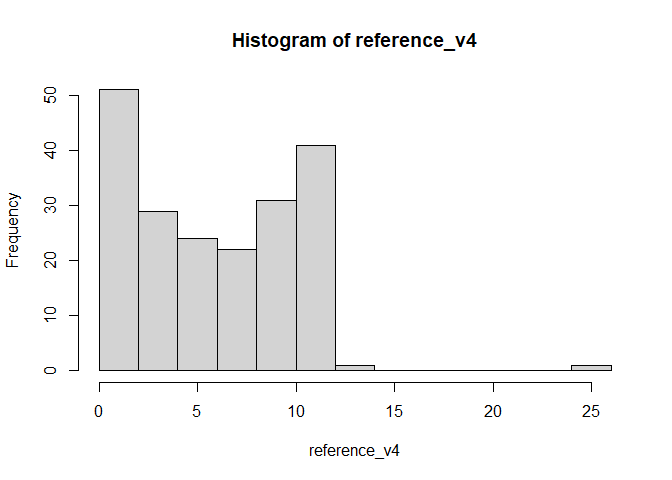
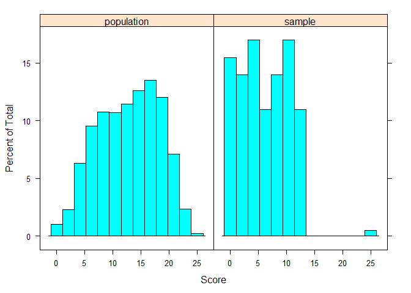

<!-- README.md is generated from README.Rmd. Please edit that file -->

# drawsample

<!-- badges: start -->

[](https://travis-ci.com/atalay-k/drawsample)
<!-- badges: end -->

The goal of drawsample is to …

## Installation

You can install the released version of drawsample from
[CRAN](https://CRAN.R-project.org) with:

``` r
install.packages("drawsample")
```

And the development version from [GitHub](https://github.com/) with:

``` r
# install.packages("devtools")
devtools::install_github("atalay-k/drawsample",dependencies = TRUE,upgrade = "never")
```

## Example

Same basic examples for the usage:

``` r
library(drawsample)
## basic example code
# Draw a sample based on Score_1(from negatively skewed to normal)
 draw_sample(dist=example_data[,c(1,2)],n=200,skew = 0,kurts = 0,
 output_name = c("sample", "1"))
```



    #> $desc
    #>               n  mean   sd min max  skew kurtosis
    #> population 5000 14.61 4.90   0  25 -0.40    -0.35
    #> reference   200 11.64 4.22   0  25  0.02     0.00
    #> sample      200 12.15 4.19   1  25  0.07    -0.07
    #> 
    #> $sample
    #> # A tibble: 200 x 2
    #>       id     x
    #>    <dbl> <dbl>
    #>  1  4371     1
    #>  2  3087     2
    #>  3  1197     2
    #>  4  3814     2
    #>  5   170     4
    #>  6  4887     3
    #>  7  4847     4
    #>  8  4215     6
    #>  9  2878     6
    #> 10  1003     6
    #> # ... with 190 more rows
    #> 
    #> $graph



``` r
# Draw a sample based on Score_2 (from negatively skewed to positively skewed)
 draw_sample(dist=example_data[,c(1,3)],n=200,skew = 1,kurts = 1,
 output_name = c("sample", "2"))
```



    #> $desc
    #>               n  mean   sd min max  skew kurtosis
    #> population 5000 12.78 5.22   0  25 -0.17    -0.88
    #> reference   200  5.98 4.58   0  25  0.99     1.01
    #> sample      200  6.49 4.62   0  25  0.89     0.75
    #> 
    #> $sample
    #> # A tibble: 200 x 2
    #>       id     x
    #>    <dbl> <dbl>
    #>  1  3752     1
    #>  2  1219     2
    #>  3  4496     1
    #>  4  1358     1
    #>  5  2330     1
    #>  6  4270     2
    #>  7   218     2
    #>  8  4929     2
    #>  9  2383     2
    #> 10  4805     1
    #> # ... with 190 more rows
    #> 
    #> $graph



``` r
# Draw a sample based on Score_2 (from negatively skewed to positively skewed with replacement)
 draw_sample(dist=example_data[,c(1,3)],n=200,skew = 0.5,kurts = 0.4,
 replacement=TRUE,output_name = c("sample", "3"))
```



    #> $desc
    #>               n  mean   sd min max  skew kurtosis
    #> population 5000 12.78 5.22   0  25 -0.17    -0.88
    #> reference   200  5.86 4.21   0  25  0.47     0.38
    #> sample      200  6.36 4.13   0  25  0.42     0.36
    #> 
    #> $sample
    #> # A tibble: 200 x 2
    #>       id     x
    #>    <dbl> <dbl>
    #>  1  2112     1
    #>  2  3896     1
    #>  3  3007     1
    #>  4   400     2
    #>  5  4570     1
    #>  6  2667     1
    #>  7  3896     1
    #>  8  4433     1
    #>  9  3593     1
    #> 10  4280     2
    #> # ... with 190 more rows
    #> 
    #> $graph


